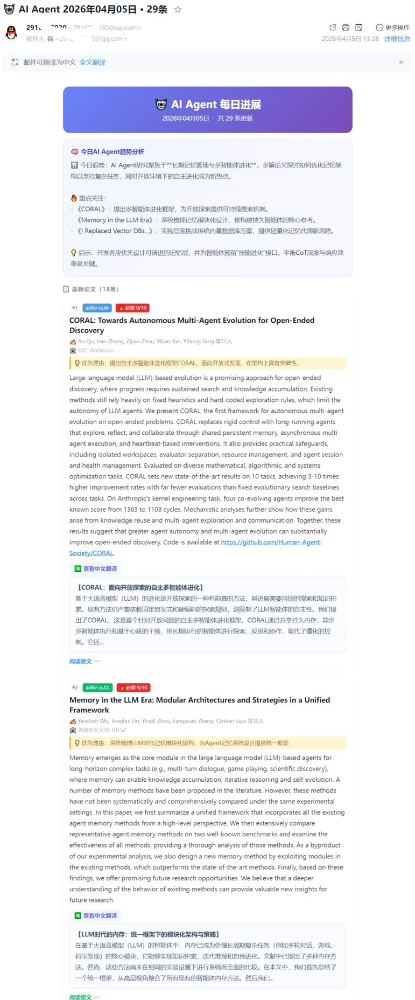

# AgentDaily

每天自动抓取 AI Agent 领域最新论文、博客、GitHub 版本和产品动态，经 DeepSeek 打分、翻译后发送到你的邮箱。

---

## 快速开始

### 1. 安装依赖

```bash
pip install -r requirements.txt
```

### 2. 配置环境变量

复制 `.env.example` 为 `.env`，填入你的配置：

```bash
cp .env.example .env
```

```ini
EMAIL_SENDER=你的QQ邮箱@qq.com
EMAIL_AUTH_CODE=你的QQ邮箱授权码
DEEPSEEK_API_KEY=sk-xxxxxxxxxxxxxxxxxxxxxxxx
EMAIL_RECEIVER=接收邮件的邮箱@example.com
```

> **如何获取 QQ 邮箱授权码？**
> 登录 QQ 邮箱 → 设置 → 账户 → 找到「POP3/IMAP/SMTP 服务」→ 开启 SMTP → 按提示发送短信 → 得到16位授权码
> ⚠️ 授权码不是你的 QQ 密码，是专门用于第三方客户端的密码

> **如何获取 DeepSeek API Key？**
> 访问 [platform.deepseek.com](https://platform.deepseek.com) → 注册登录 → API Keys → 创建新 Key
> 没有 Key 时程序仍可运行，但不会打分、翻译和生成今日总结

### 3. 手动运行

```bash
python main.py
```

### 4. 定时自动运行（GitHub Actions）

推送到 GitHub 后，`.github/workflows/daily_push.yml` 会自动每天定时执行。

在 GitHub 仓库 → Settings → Secrets 中添加以下变量：
- `EMAIL_SENDER`
- `EMAIL_AUTH_CODE`
- `DEEPSEEK_API_KEY`
- `EMAIL_RECEIVER`

---

## 功能说明

| 功能 | 说明 |
|------|------|
| 论文抓取 | HuggingFace Daily Papers + arXiv（cs.AI / cs.CL / cs.LG） |
| 博客 | LangChain Blog、Towards Data Science、DeepLearning.AI |
| GitHub | 关注仓库（LangGraph、LlamaIndex、AutoGen 等）的最新 Release |
| 产品动态 | Hacker News、Product Hunt |
| 去重 | 已发送内容记录在 `sent.json`，不重复推送 |
| 打分过滤 | DeepSeek 对每条内容打分，过滤水文（需 API Key） |
| 中文翻译 | 高分内容自动翻译标题和摘要（需 API Key） |
| 今日总结 | DeepSeek 生成当日 AI 领域趋势总结（需 API Key） |

---

## 常见问题

**邮件发不出去？**
- 检查 `EMAIL_AUTH_CODE` 是否是授权码（不是QQ密码）
- QQ 邮箱 SMTP 服务是否已开启

**论文数量很少或为0？**
- 周末 arXiv 不更新，属正常现象
- 可调整 `config/settings.py` 中的 `ARXIV_HOURS`（默认72小时）扩大时间范围

**翻译/打分/总结没有生效？**
- 检查 `.env` 中 `DEEPSEEK_API_KEY` 是否填写

**重置去重记录？**
```bash
echo "[]" > sent.json
```
